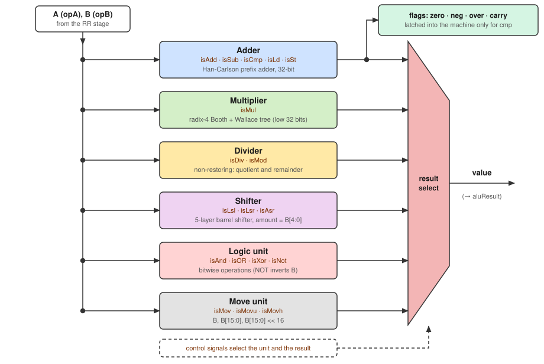
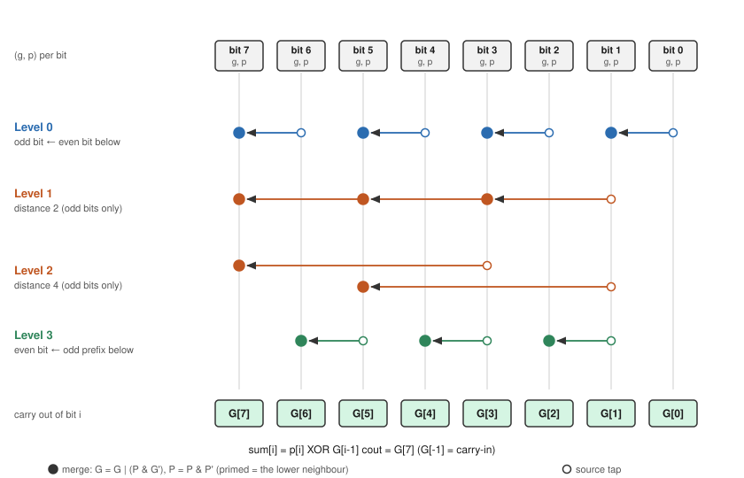
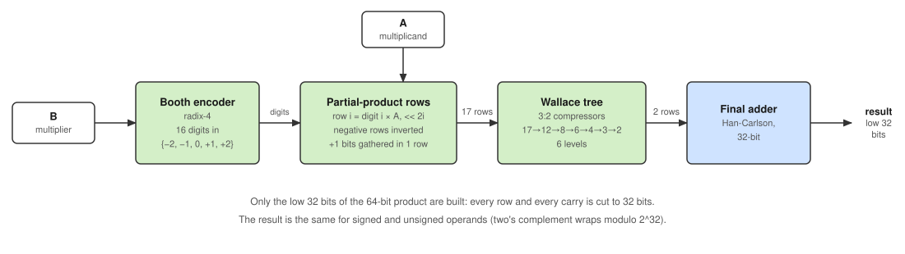
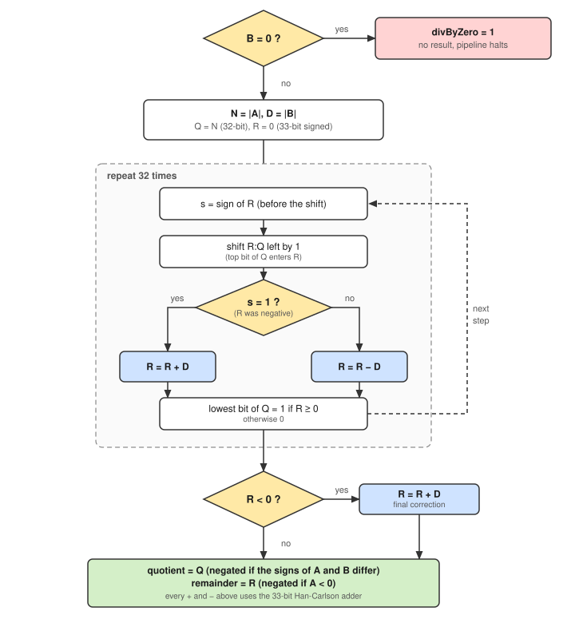
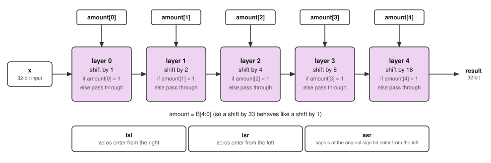

# ALU: design, structure and execution

A 32-bit, purely combinational ALU for the RISC201 simulator. It is called from the **EX stage** of the pipeline and nowhere else.

| File | Role |
|---|---|
| `include/alu.hpp` | `ALUResult` struct and the `ALU` class |
| `src/alu.cpp` | the six units and the dispatch logic |
| `tests/alu_test.cpp` | standalone self-test (compares every unit with C++ operators) |

The ALU never touches `MachineState`. It receives the control signals and two operands, and returns a value plus flags. The pipeline decides what to do with them.

---

## 1. Interface

```cpp
ALUResult ALU::execute(const controlsignals& s, int32_t a, int32_t b) const;
```

`a` is `opA` and `b` is `opB`, both read in the RR stage (`opA = Reg[rs1]`, `opB` = the immediate or `Reg[rs2]`).

| `ALUResult` field | Meaning |
|---|---|
| `value` | the result; EX stores it in `aluResult` |
| `zero`, `neg`, `over`, `carry` | adder flags (see section 4) |
| `updateFlags` | `true` only for `cmp`; EX copies the four flags into the machine only when this is set |
| `divByZero` | `div`/`mod` with `B == 0`; EX halts the run with an error (no exception handling yet) |

---

## 2. Big picture

The figure shows the ALU as black boxes. Section 3 opens each box.



**How one operation flows through it**

1. EX passes `opA`, `opB` and the control signals of the current instruction to `execute()`.
2. The control signals pick exactly one unit. The other units are idle.
3. That unit computes the result from A and/or B.
4. The result select returns `value`. The adder also produces the flags.

**Which unit handles which instruction**

| Signals | Unit | Computes | Flags latched? |
|---|---|---|---|
| `isAdd` | Adder | `A + B` | no |
| `isLd`, `isSt` | Adder | `A + B` = base + offset (the memory address) | no |
| `isSub` | Adder | `A − B` | no |
| `isCmp` | Adder | `A − B` | **yes** |
| `isMul` | Multiplier | low 32 bits of `A × B` | no |
| `isDiv` / `isMod` | Divider | quotient / remainder of `A ÷ B` | no |
| `isLsl` / `isLsr` / `isAsr` | Shifter | `A` shifted by `B[4:0]` | no |
| `isAnd` / `isOR` / `isXor` | Logic unit | `A & B`, `A \| B`, `A ^ B` | no |
| `isNot` | Logic unit | `~B` | no |
| `isMov` | Move unit | `B` | no |
| `isMovu` | Move unit | `B & 0xFFFF` | no |
| `isMovh` | Move unit | `(B & 0xFFFF) << 16` | no |

Instructions that never reach the ALU: `nop`, `ret`, `b`, `beq`, `bgt`, `bsm` and `call`. EX handles those directly. `call` computes its link value (`pc + 1`) there, and branch targets are a plain `pc + offset`.

---

## 3. The units

### 3.1 Adder: Han-Carlson parallel-prefix

Used by `add`, `sub`, `cmp`, `ld`/`st` addresses, the multiplier's last step, the divider, and negation (`~x + 1`).

**Idea.** For every bit, compute *generate* `g = a & b` and *propagate* `p = a ^ b`. The carry out of a group of bits is found by merging the groups' `(G, P)` pairs:

```
(G, P) merged with (G', P')  =  ( G | (P & G'),  P & P' )      (primed = the lower neighbour)
```

A prefix network applies this merge in a few parallel levels, so no carry has to ripple through all 32 bits. After the network, `G[i]` is the carry out of bit `i`.



The figure shows an 8-bit instance. Han-Carlson is Kogge-Stone applied only to the odd bits, plus one level at each end:

| Level | What happens | 8 bits | 32 bits |
|---|---|---|---|
| 0 | each odd bit merges with the even bit below it | 1 level | 1 level |
| 1…k | Kogge-Stone on the odd bits, distance 2, 4, 8, … | 2 levels | 4 levels (2, 4, 8, 16) |
| last | each even bit merges with the odd prefix just below it | 1 level | 1 level |
| **total** | | **4** | **6** |

For 32 bits that is 6 levels and 80 merge cells. Kogge-Stone would need 5 levels and 129 cells, so Han-Carlson trades one level for about 40% fewer cells and much less wiring.

**Sum and carry-in.** The carry-in is folded into bit 0 (`G[0] = g0 | (p0 & cin)`). Then `sum[i] = p[i] XOR (carry into bit i)`, where the carry into bit `i` is `G[i−1]` (and `cin` for bit 0).

**Subtraction.** `A − B` is computed as `A + ~B + 1`, with the same adder and carry-in = 1.

**Flags** (derived from the adder):

| Flag | Rule |
|---|---|
| `zero` | result is 0 |
| `neg` | bit 31 of the result (raw sign) |
| `carry` | carry out of bit 31 (for a subtraction, 1 means *no borrow*) |
| `over` | signed overflow = carry into bit 31 XOR carry out of bit 31 |

The adder is written for any width up to 64 bits. The divider reuses it at 33 bits.

---

### 3.2 Multiplier: radix-4 Booth + Wallace tree (low 32 bits)



**Booth encoding.** B is read as 16 overlapping triples `(b[2i+1], b[2i], b[2i−1])` with `b[−1] = 0`. Each triple gives a digit in {−2, −1, 0, +1, +2}, so there are only 16 rows instead of 32.

| Triple | 000 | 001 | 010 | 011 | 100 | 101 | 110 | 111 |
|---|---|---|---|---|---|---|---|---|
| Digit | 0 | +1 | +1 | +2 | −2 | −1 | −1 | 0 |

**Partial-product rows.** Row `i` is `|digit| × A` (A, or A shifted left by 1, or 0) shifted left by `2i` and cut to 32 bits. For a negative digit the row is stored *inverted*, and a `+1` is owed at column `2i` (because `−x = ~x + 1`). Those owed bits (at most 16, one per negative row) are collected into one extra row, giving **17 rows**.

**Wallace tree.** Rows are grouped in threes and each group is replaced by two rows (a sum row and a carry row, using full adders). Repeating this brings the rows down `17 → 12 → 8 → 6 → 4 → 3 → 2` in 6 levels.

**Final add.** The last two rows go through the 32-bit Han-Carlson adder. Because only the low 32 bits are built, signed and unsigned operands give the same result.

**Worked example, 7 × 3** (`A = 7`, `B = 3 = …0011`):

| Row | Triple | Digit | Row value |
|---|---|---|---|
| 0 | `(b1,b0,b−1) = 1,1,0` | −1 | `~7 = 0xFFFFFFF8` (and one "+1" bit at column 0) |
| 1 | `(b3,b2,b1) = 0,0,1` | +1 | `7 << 2 = 28` |
| 2…15 | `0,0,0` | 0 | 0 |
| extra | | | `1` (the owed "+1") |

Sum: `0xFFFFFFF8 + 28 + 1 = 0x100000015`, which is `21` after dropping the carry out of bit 31. ✓

---

### 3.3 Divider: non-restoring



Used by `div` (quotient) and `mod` (remainder). One piece of hardware produces both.

**Algorithm.** The operands are made positive (`N = |A|`, `D = |B|`). A 33-bit signed partial remainder `R` starts at 0. The extra bit guarantees `2R + bit` never overflows, even for `|INT_MIN| = 2^31`. Then, 32 times:

1. note the sign of `R`;
2. shift the pair `R:Q` left by one bit (the top bit of `Q` enters `R`);
3. add `D` if `R` was negative, otherwise subtract `D`;
4. set the lowest bit of `Q` to 1 if the new `R ≥ 0`, otherwise 0.

If `R` ends negative, one correction adds `D` back. Finally the signs are restored: the quotient is negated when the signs of A and B differ, and the remainder takes the sign of A. Every add/subtract goes through the Han-Carlson adder.

**Worked example (4-bit illustration), 7 ÷ 2:**

| Step | R before | After shift (R : Q) | Operation | R after | New q bit | Q |
|---|---|---|---|---|---|---|
| 1 | 0 | 0 : 1110 | R − 2 | −2 | 0 | 1110 |
| 2 | −2 | −3 : 1100 | R + 2 | −1 | 0 | 1100 |
| 3 | −1 | −1 : 1000 | R + 2 | 1 | 1 | 1001 |
| 4 | 1 | 3 : 0010 | R − 2 | 1 | 1 | 0011 |

`R = 1` is not negative, so there is no correction: quotient `3`, remainder `1`. ✓

**Special cases**

| Case | Result |
|---|---|
| `B = 0` | `divByZero = 1`; the pipeline halts with an error message |
| `−7 ÷ 2` | quotient −3, remainder −1 (truncates toward zero) |
| `7 ÷ −2` | quotient −3, remainder 1 |
| `INT_MIN ÷ −1` | quotient wraps to `INT_MIN`, remainder 0, `over = 1` in the result (not latched, see section 6) |

---

### 3.4 Shifter: logarithmic barrel shifter



Five layers, each of which either shifts by a fixed amount (1, 2, 4, 8, 16) or passes the value through, depending on one bit of the shift amount. Any shift from 0 to 31 is the combination of the layers whose bits are set.

- The amount is `B[4:0]` (register or immediate), so a shift by 33 behaves like a shift by 1.
- `lsl` and `lsr` shift in zeros.
- `asr` shifts in copies of the **original** sign bit.

---

### 3.5 Logic unit

Bitwise and trivial: one gate per bit.

| Signal | Result |
|---|---|
| `isAnd` | `A & B` |
| `isOR` | `A \| B` |
| `isXor` | `A ^ B` |
| `isNot` | `~B` (the assembler puts the source of `not` in the B position) |

---

### 3.6 Move unit

No arithmetic. It selects B (or part of it).

| Signal | Result | Note |
|---|---|---|
| `isMov` | `B` | register or sign-extended 16-bit immediate |
| `isMovu` | `B & 0xFFFF` | lower 16 bits set, **upper half cleared** |
| `isMovh` | `(B & 0xFFFF) << 16` | upper 16 bits set, **lower half cleared** |

Both write the whole register. To build a 32-bit constant, combine them with an `or`. The assembler takes decimal immediates:

```
movh r6 4660      ; r6 = 0x12340000
movu r7 22136     ; r7 = 0x00005678
or   r6 r6 r7     ; r6 = 0x12345678
```

---

## 4. Flags and branch conditions

Only `cmp` updates the machine flags (via `updateFlags`). It computes `A − B` on the adder and EX copies `zero`, `neg`, `over` and `carry`. The conditional branches then read those flags in EX:

| Branch | Taken when | Meaning |
|---|---|---|
| `beq` | `zero` | A = B |
| `bsm` | `neg != over` | A < B (signed) |
| `bgt` | `!zero && neg == over` | A > B (signed) |
| `b` | always | unconditional |

The raw sign alone is not enough: `INT_MIN − 1` overflows to a positive-looking number (`neg = 0`) but A is clearly smaller, and that is exactly the case where `over = 1`, so `neg != over` is still correct.

---

## 5. Execution examples

**`cmp r3 r1` with `r3 = 2`, `r1 = 5`**

1. RR: `opA = 2`, `opB = 5`.
2. EX calls the ALU with `isCmp`: the adder computes `2 + ~5 + 1 = 0xFFFFFFFD` (−3).
3. Flags: `zero = 0`, `neg = 1`, `over = 0`, `carry = 0` (a borrow occurred).
4. `updateFlags = 1`, so EX writes the flags into the machine. `cmp` writes no register, so the −3 is discarded.

**`mul r2 r2 r3` with `r2 = 1`, `r3 = 1`**

1. RR: `opA = 1`, `opB = 1`.
2. The multiplier runs Booth encoding, builds 17 rows, reduces them with the Wallace tree and adds the final two rows. The result is 1.
3. EX stores 1 in `aluResult`, and RW writes it to `r2`. The flags are untouched.

**`ld r9 0[r0]`**

1. RR: `opA = Reg[r0] = 0` (the base), `opB = 0` (the offset).
2. The ALU adder computes `0 + 0 = 0`, which is the effective address. MEM then reads `memory[0]`.

---

## 6. Design decisions and limitations

| Decision | Choice |
|---|---|
| Adder | Han-Carlson (6 levels, 80 cells at 32 bits) |
| Multiplier | radix-4 Booth + Wallace tree, **low 32 bits only** (no 64-bit product) |
| Divider | non-restoring, on magnitudes with sign fix-up |
| Shift amount | low 5 bits of B |
| `movu` / `movh` | full overwrite of the register (the other half is cleared) |
| Which instructions set flags | only `cmp` |
| Modelling level | bit-level for the adder, Booth rows, Wallace levels, barrel layers and divider steps |

Known limitations:

- **No exception handling.** Division by zero halts the pipeline with a message. The R4/R5 exception framework from the ISA document is not implemented.
- **`div` overflow is not visible.** `INT_MIN ÷ −1` sets `over` in `ALUResult`, but only `cmp` latches flags, so the machine never sees it.
- **No timing model.** Every ALU operation takes one step in the simulator, even though a real divider would take many cycles.
- `add`/`sub` overflow is invisible for the same reason: they do not update the flags.

---

## 7. Testing

`tests/alu_test.cpp` drives every unit through `ALU::execute()` with the same control signals the pipeline uses, and compares each result with plain C++ operators.

```
g++ -std=c++17 -O2 -Wall -Wextra tests/alu_test.cpp src/alu.cpp -o alu_test && ./alu_test
```

- **Inputs:** all pairs of 27 edge values (0, ±1, `INT_MIN`, `INT_MAX`, 16-bit boundaries, alternating bit patterns) plus 150,000 random pairs (full-range and small-range mixes).
- **Checked:** `add`, `sub`, `cmp` value and all four flags, the `beq`/`bsm`/`bgt` conditions, `mul`, `div`, `mod` (including `B = 0` and `INT_MIN ÷ −1`), the three shifts, the four logic operations, and `mov`/`movu`/`movh`.
- **Last result:** 4,370,999 checks, 0 failures.

---

## 8. Extending the ALU

To add an instruction: add its signal to `controlsignals` (and decode it in `controlunit.cpp`), add the case to the dispatch in `ALU::execute()` (or a new unit function), and add a check to `alu_test.cpp`.