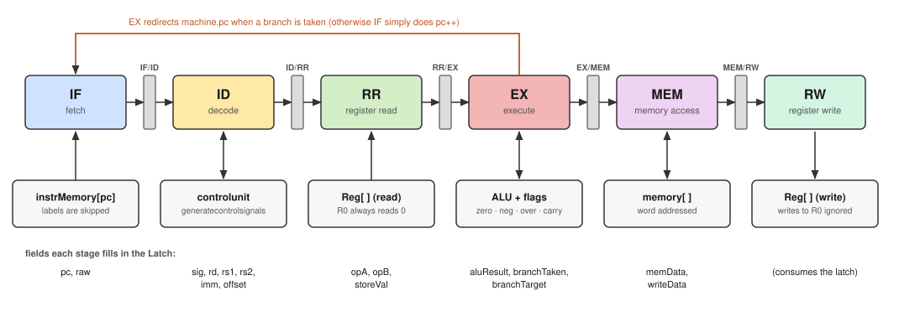

# Pipeline: design, structure and execution

A 6-stage pipeline model for the RISC201 simulator: **IF → ID → RR → EX → MEM → RW**. It runs the program the assembler placed in `MachineState::instrMemory`.

> **Current state:** the stages are structured as a real pipeline (each stage reads one latch and writes the next), but `run()` still sends **one instruction at a time** through all six stages. There is no overlap yet, so no hazards, stalls or flushes. Section 9 lists what changes when the stages overlap.

| File | Role |
|---|---|
| `include/pipeline6stage.hpp` | `Latch` struct, `Pipeline6stage` class |
| `src/pipeline6stage.cpp` | `run()` and the six stages |
| `include/controlunit.hpp`, `src/controlunit.cpp` | decodes opcode bits into control signals (used by ID) |
| `include/alu.hpp`, `src/alu.cpp` | the ALU (used by EX), see `ALU.md` |
| `include/MachineState.hpp` | registers, memory, flags, pc, instruction memory (not modified) |

---

## 1. Structure



- The six stage boxes are connected through **latches** (`if_id`, `id_rr`, `rr_ex`, `ex_mem`, `mem_rw`). Each one is a `Latch` struct.
- Each stage copies the latch it receives, fills in its own fields, and passes it on.
- The boxes underneath are the pieces of machine state each stage touches.
- The orange arrow shows the only backwards path: EX can overwrite `machine.pc` when a branch is taken.

---

## 2. What the pipeline reads: the program in memory

After `Assembler::assemble()`, `machine.instrMemory` holds one string per source line:

- **Instructions** are 32-character binary strings.
- **Labels** (`.loop:`) are stored as plain text and **take up a slot**. IF skips any entry starting with `.`.

`machine.pc` is an index into `instrMemory`.

**Branch targets.** The assembler stores the offset relative to the branch's own index, pointing at the first instruction after the label:

```
target = (index of the branch) + offset
```

Example: `beq .loop` at index 8, with `.loop:` at index 4. The first instruction after the label is index 5, so `offset = 5 − 8 = −3` and `target = 8 + (−3) = 5`.

### Instruction word layout

Positions are string indices (index 0 is the first character, the MSB).

| Bits | Field | Notes |
|---|---|---|
| 0–4 | opcode | decoded by the control unit |
| 5 | I (immediate flag) | for branches this bit belongs to the offset |
| 6–10 | `rd` | for `st`, the register being stored |
| 11–15 | `rs1` | for `ld`/`st`, the base register |
| 16–20 | `rs2` | used when I = 0 |
| 16–31 | `imm` | used when I = 1, 16-bit, sign-extended |
| 5–31 | `offset` | branches only, 27-bit, sign-extended |

How the assembler fills them:

| Instruction | Layout |
|---|---|
| `add sub mul div mod and or xor lsl lsr asr` | `op I rd rs1 (rs2 + 11 zeros \| imm16)` |
| `cmp` | `op I 00000 rs1 (rs2 + 11 zeros \| imm16)` (`rd` unused) |
| `mov movu movh not` | `op I rd 00000 (rs2 + 11 zeros \| imm16)` (`rs1` unused) |
| `ld`, `st` (`ld r9 0[r0]`) | `op 1 rd rs1=base imm16=offset` |
| `beq bgt bsm b call` | `op offset27` |
| `nop`, `ret` | `op` followed by 27 zeros |

Register names: `ra` = r1, `sp` = r2. **R0 is ground**: it always reads 0 and writes to it are ignored.

---

## 3. Data structures

### The `Latch`

One instruction's data as it travels through the stages:

| Field | Filled by | Meaning |
|---|---|---|
| `valid`, `pc`, `raw` | IF | the instruction's index and its 32-char word |
| `sig` | ID | control signals (a copy of `controlunit::signals`) |
| `rd`, `rs1`, `rs2`, `imm`, `offset` | ID | decoded fields (`imm`, `offset` sign-extended) |
| `opA`, `opB`, `storeVal` | RR | register values: `opA = Reg[rs1]`, `opB` = `imm` or `Reg[rs2]`, `storeVal = Reg[rd]` for `st` |
| `aluResult` | EX | ALU result, ld/st address, or the `call` link value |
| `branchTaken`, `branchTarget` | EX | branch decision (for the trace) |
| `memData` | MEM | loaded value (`ld`) |
| `writeData` | MEM | value that RW writes to the register |

### The control unit and `controlsignals`

`controlunit::generatecontrolsignals(opcodeAndI)` takes the first 6 characters (5 opcode bits plus the I bit) and sets one boolean per instruction (`isAdd`, `isLd`, `isBeq`, …) plus `isImm`. `Pipeline6stage` inherits from `controlunit`, so ID calls it directly and copies `signals` into the latch.

`controlsignals` also has helper methods that the stages use to ask questions about an instruction:

| Method | True for |
|---|---|
| `readsRs1()` | `add sub mul div mod cmp and or xor lsl lsr asr ld st` |
| `usesOperandB()` | everything in `readsRs1()` plus `not mov movu movh` |
| `usesOffset()` | `beq bgt bsm b call` |
| `writesReg()` | `add sub mul div mod and or not xor mov movu movh lsl lsr asr ld call` |
| `isKnown()` | any recognised instruction (false means an illegal opcode) |

---

## 4. Execution: `run()`

```cpp
machine.reset();                       // registers, memory, flags, pc = 0  (instrMemory is kept)
halted = false;
while (!halted
       && machine.pc is inside instrMemory
       && executed < kMaxInstructions) {      

    if (!IF_Stage(machine)) continue;         // a label: skipped, nothing to execute
    ID_Stage(machine);   if (halted) break;
    RR_Stage(machine);
    EX_Stage(machine);   if (halted) break;
    MEM_Stage(machine);  if (halted) break;
    RW_Stage(machine);
    executed++;
}
```

Each trip around the loop runs one instruction through all six stages. At the end `run()` prints the instruction count, every non-zero register and every non-zero data-memory word (when `trace` is on).

**The run ends when** `pc` leaves the program (normal end), a fault sets `halted`, or the instruction cap is hit.

---

## 5. The stages

### IF: fetch
Reads `instrMemory[pc]`. If it is a label, it just does `pc++` and reports "nothing fetched". Otherwise it checks the word is 32 characters, stores `pc` and `raw` in `if_id`, and does `pc++`.

### ID: decode
Calls the control unit on `raw[0..5]` and stores the signals in the latch. An unrecognised opcode is a fault. It then extracts `rd` (bits 6–10), `rs1` (11–15), `rs2` (16–20), `imm` (16–31, sign-extended) and `offset` (5–31, sign-extended).

### RR: register read
Reads the register file according to the control signals (R0 always reads 0):

- `opA = Reg[rs1]` if `readsRs1()`; for `ret`, `opA = Reg[ra]`
- `opB = isImm ? imm : Reg[rs2]` if `usesOperandB()`
- `storeVal = Reg[rd]` for `st` (rd is the *source* register of a store)

### EX: execute
- `call`: `aluResult = pc + 1` (the return address).
- `ld`, `st`, every register-writing instruction, and `cmp`: call the ALU with the control signals and `opA`/`opB`.
  - A division by zero halts the run.
  - Only `cmp` copies the ALU's flags into `machine.zero/neg/over/carry`.
- Branch decision, using `pc` = the instruction's own index:

| Instruction | Taken when | New `machine.pc` |
|---|---|---|
| `b`, `call` | always | `pc + offset` |
| `beq` | `zero` | `pc + offset` |
| `bgt` | `!zero && neg == over` | `pc + offset` |
| `bsm` | `neg != over` | `pc + offset` |
| `ret` | always | `opA` (= `Reg[ra]`) |

### MEM: data memory
For `ld`/`st` the address is `aluResult`, a **word index** into `machine.memory`. An out-of-range address is a fault. `ld` reads `memory[addr]` into `memData`; `st` writes `storeVal` to `memory[addr]`. For every instruction, `writeData = isLd ? memData : aluResult`.

### RW: register write
If `writesReg()` and the destination is not R0, `Reg[dest] = writeData`. The destination is `ra` (r1) for `call` and `rd` otherwise. Then the trace line is printed.

---

## 6. What each instruction class does

| Class | RR reads | EX | MEM | RW |
|---|---|---|---|---|
| arithmetic, logic, shift, `mov`, `movu`, `movh`, `not` | `opA`, `opB` as needed | ALU result | pass | `Reg[rd] = result` |
| `cmp` | `opA`, `opB` | ALU, **flags updated** | pass | nothing |
| `ld` | base, offset | address = base + offset | `memData = memory[addr]` | `Reg[rd] = memData` |
| `st` | base, offset, `storeVal` | address = base + offset | `memory[addr] = storeVal` | nothing |
| `beq` `bgt` `bsm` | nothing | test flags, maybe `pc = pc + offset` | pass | nothing |
| `b` | nothing | `pc = pc + offset` | pass | nothing |
| `call` | nothing | link = `pc + 1`, `pc = pc + offset` | pass | `Reg[ra] = link` |
| `ret` | `opA = Reg[ra]` | `pc = opA` | pass | nothing |
| `nop` | nothing | nothing | pass | nothing |

---

## 7. Worked example 1: `t_asmblr.txt`

```
.main:                   index 0
mov r1 5                 index 1
mov r2 1                 index 2
mov r3 1                 index 3
.loop:                   index 4
mul r2 r2 r3             index 5
add r3 r3 1              index 6
cmp r3 r1                index 7
beq .loop                index 8   (offset = 5 − 8 = −3)
st r2 0[r0]              index 9
add sp sp 8              index 10
st ra 0[sp]              index 11
```

Actual trace printed by the simulator (`pc=` is the instruction's index, then its binary word, then the RW action):

```
pc=1   01011100001000000000000000000101  r1 <- 5
pc=2   01011100010000000000000000000001  r2 <- 1
pc=3   01011100011000000000000000000001  r3 <- 1
pc=5   00011000010000100001100000000000  r2 <- 1
pc=6   00001100011000110000000000000001  r3 <- 2
pc=7   00110000000000110000100000000000  (no writeback)
pc=8   10100111111111111111111111111101  (no writeback)
pc=9   10011100010000000000000000000000  (no writeback)
pc=10  00001100010000100000000000001000  r2 <- 9
pc=11  10011100001000100000000000000000  (no writeback)
---- done: 10 instructions ----
r1 = 5   r2 = 9   r3 = 2
mem[0] = 1   mem[9] = 5
```

How to read it:

| Index | Instruction | What happened |
|---|---|---|
| 0, 4 | labels | IF skipped them (no trace line, not counted) |
| 1–3 | `mov` | ALU move unit returns B; RW writes r1 = 5, r2 = 1, r3 = 1 |
| 5 | `mul r2 r2 r3` | 1 × 1 = 1 → r2 |
| 6 | `add r3 r3 1` | r3 = 2 |
| 7 | `cmp r3 r1` | 2 − 5 = −3: flags `zero=0 neg=1 over=0 carry=0`; no register written |
| 8 | `beq .loop` | `zero` is 0, so **not taken**; `pc` stays 9 (no `[jump]` in the trace) |
| 9 | `st r2 0[r0]` | address 0 + 0 = 0; `memory[0] = r2 = 1` |
| 10 | `add sp sp 8` | r2 = 1 + 8 = 9 |
| 11 | `st ra 0[sp]` | address 9 + 0 = 9; `memory[9] = r1 = 5` |

After index 11, IF has moved `pc` to 12 = `instrMemory.size()`, so the loop ends.

This program only loops back while `r3 == r1`, so it falls straight through. In `t1_asmblr.txt`, a `bsm` loop runs nine times, ending with r1 = 10, r2 = 45 and `mem[0] = 45` after 40 instructions.

---

## 8. Worked example 2: branches, `call` and `ret`

```
.main:                       0
mov r6 7                     1
mov r7 3                     2
cmp r6 r7                    3
bgt .big                     4
mov r11 1                    5
.big:                        6
mov r12 2                    7
call .func                   8
st r8 0[r0]                  9
b .end                      10
.func:                      11
mul r8 r6 r7                12
sub r8 r8 -1                13
ld r9 0[r0]                 14
ret                         15
.end:                       16
add r10 r8 r8               17
```

Trace (binary words omitted):

```
pc=1   r6 <- 7
pc=2   r7 <- 3
pc=3   (no writeback)                       cmp 7,3: not equal, 7 > 3
pc=4   (no writeback)  [jump to 7]          bgt taken, skips "mov r11 1"
pc=7   r12 <- 2
pc=8   r1 <- 9  [jump to 12]                call: ra = 9, jump into .func
pc=12  r8 <- 21
pc=13  r8 <- 22                             sub with the negative immediate -1
pc=14  r9 <- 0                              ld from memory[0]
pc=15  (no writeback)  [jump to 9]          ret: pc = Reg[ra]
pc=9   (no writeback)                       st: memory[0] = 22
pc=10  (no writeback)  [jump to 17]         b .end
pc=17  r10 <- 44
```

Final state: `r1 = 9, r6 = 7, r7 = 3, r8 = 22, r10 = 44, r12 = 2, mem[0] = 22`.

---

## 9. Faults, limitations and what comes next

**Faults** (each prints a message beginning `[pipeline]` and stops the run):

| Stage | Cause |
|---|---|
| IF | instruction word is not 32 characters |
| ID | illegal opcode |
| EX | division by zero (`div`/`mod` with B = 0) |
| MEM | data address outside `machine.memory` |

**Current limitations**

- **No overlap.** One instruction is in flight at a time, so the simulator counts instructions, not clock cycles.
- **No hazards to handle.** A branch takes effect immediately, and each instruction sees the registers written by the previous one.
- A `ret` with `ra = 0` jumps back to index 0 and keeps running until the instruction cap stops it.
- The assembler (not modified) crashes on blank lines in the `.txt` source, and uses relative paths, so run from the project root.

**What changes when the stages overlap**

1. `run()` becomes a cycle loop: every cycle all six stages work on different instructions, and the latches update together (evaluate the stages from RW back to IF, or use double-buffered latches).
2. **Data hazards.** Instructions need registers that an older instruction has not written yet (`add r3 r3 1` followed by `cmp r3 r1`). Options are stalling or forwarding. For `st` and for `ret`, the hazard logic must treat `rd` and `ra` as sources, and `call` as a writer of `ra`.
3. **Control hazards.** A branch is only resolved in EX, so the younger instructions already in IF, ID and RR must be flushed when it is taken (the `pc` redirect in EX already exists).
4. Cycle counting and a stall/flush log in the trace.

---

## 10. Build and run

```
g++ -std=c++17 main.cpp src/controlunit.cpp src/pipeline6stage.cpp src/alu.cpp -o sim
./sim
```

Run from the project root. `assembler.cpp` and `disassembler.cpp` are not listed because `main.cpp` includes them directly. Set `pipeline.trace = false` in `main.cpp` to silence the trace.